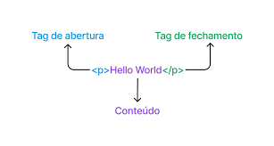

## 📚 Aula 01: UC-03 - Front End Essencial

**✅ Tema:** Entender que a Web nasceu da necessidade de compartilhar informações e que o HTML é a ferramenta que organiza esse conteúdo.

---

### 🧠 O que vimos hoje?

#### A História (Sem Sopa de Letrinhas):

Tudo começou com **Tim Berners-Lee** no CERN. Ele precisava de **uma forma de enviar documentos entre laboratórios de pesquisa**.
Ele criou o **HTML para dar estrutura aos textos** e o HTTP para ser o "entregador" desses documentos pela rede.
Assim nasceu a World Wide Web (WWW) — a grande biblioteca mundial.

> HTML é um acrônimo para _HyperText Markup Language_ (Linguagem de marcação de hipertexto).
> Atualmente estamos na versão HTML5.

Em resumo é uma linguagem com regras de escrita para indicar ao navegador o que representa os elementos em um documento.

🔑 **Pontos Chave:**

- A primeira página da web criado no mundo era apenas texto e links. Sem cores, sem animações.

📂 **Revisão Cliente-Servidor:**

- Cliente (Você): Pede o documento (digita a URL).
- Servidor (Computador Gigante): Guarda e envia o arquivo solicitado.

#### HTML: Etiquetando a Informação:

Computadores não "leem" como humanos. Eles precisam de etiquetas (TAGS) para saber o que é o quê.

- Exemplo: Um parágrafo precisa da etiqueta `
` no início e `
` no fim. 
      

      
      

       

📌 **Revisão de HTML**

| **HTML**                                                        | **Por quê?**                                                                                                                   |
| :-------------------------------------------------------------- | :----------------------------------------------------------------------------------------------------------------------------- |
| **NÃO é linguagem de programação**                              | Ele não toma decisões (if/else), não repete tarefas (loops) e não faz cálculos                                                 |
| **É MARCAÇÃO**                                                  | Ele apenas diz "Isso aqui é um título", "Isso aqui é um link", etc.                                                            |
| Não é complexo para escrever e utilizar no navegador            | Vimos isto em sala de aula, apenas com um editor de texto (criando arquivo `.html`, inserindo as tags e rodando no navegador). |
| Não precisa de configurações avançadas ou instalações complexas | Basta apenas conhecer as regras da sintaxe html e seguir na **marcação** nos seus elementos de referência.                     |

🔱 **A Tríade da Web**
| HTML | CSS | JAVASCRIPT |
| :----: | :----: | :-----: |
| É a estrutura base | É o estilo da página | Interatividade e dinâmico - dar vida |

- O HTML é o esqueleto. Sem ele, o CSS (roupa) e o JS (comportamento) não têm onde "ficar pendurados".

---

### 🔗 Links Importantes

- [Confira a história da internet](https://github.com/gustavoguanabara/html-css/blob/master/aulas-pdf/01%20-%20Hist%C3%B3ria%20da%20Internet.pdf)
- [Tim Berners-Lee](https://pt.wikipedia.org/wiki/Tim_Berners-Lee)
- [Primeira Página Web](https://info.cern.ch/hypertext/WWW/TheProject.html)
- Existe muito o que se aprender sobre protocolo http. Segue um artigo interessante para entedimento, caso tenha curiosidade de como funciona:
    - [Protocolo HTTP](https://www.alura.com.br/artigos/http?srsltid=AfmBOoocbi9atdmYk7biukmUBUBDb3gD-Zc6cq5stAgshlwKd5UHMwRA)

---

### 🕹️ Exercícios

Bora praticar?

- Antes, crie a estrutura para executar os exercícios desta uc, crie uma pasta seguindo as orientações iniciais. [Clique aqui para ver](../../readme.md/#️-organização-do-seu-aprendizado)
- Após criar seu local de trabalho, [clique aqui para conferir nossa lista de exercícios](../../exercicios/uc-03-frontend-essencial/aula-01/📝%20Exercício%201_%20Meu%20Primeiro%20Artigo%20HTML.pdf)
