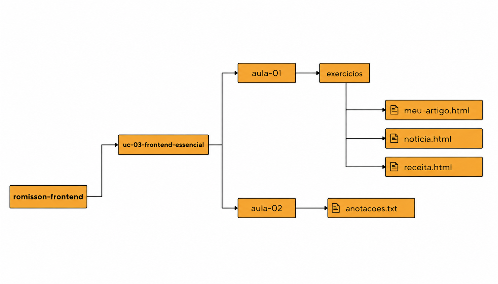

## 📚 Front End Essencial

**✅ Resumo:** Esta Unidade Curricular (UC) marca o início da nossa jornada no desenvolvimento de interfaces web. Aqui, saímos dos bastidores da lógica de programação e aprendemos a construir a parte visual com a qual o usuário interage. Vamos dominar os pilares fundamentais da web: a estrutura (HTML) e a aparência (CSS), além de entender como a internet funciona por debaixo dos panos e como colocar nossos projetos online para o mundo ver!

---

### 🎯 O que vamos aprender?

- **Fundamentos da Web:** Entender os conceitos de Protocolo HTTP, DNS, Servidores, URLs e o caminho que um site faz até chegar à tela.
- **HTML5 (O Esqueleto):** Criação de páginas semânticas, uso de tags de texto, formatação, listas ordenadas e não ordenadas, links, imagens e organização de pastas (caminhos absolutos e relativos).
- **CSS3 (A Estética):** Como separar o conteúdo da apresentação. Aprenderemos sobre cores, tipografia, espaçamentos, alinhamentos e como dar "vida e estilo" ao nosso esqueleto HTML.
- **Deploy (O Lançamento):** Hospedagem de sites estáticos de forma gratuita <!--(usando ferramentas como o Netlify)--> para gerar links reais e compartilhar nosso trabalho.

---

<!-- ### 🏆 Nossos Grandes Desafios (Avaliações)

Durante esta UC, vamos construir projetos reais que se conectam e evoluem com o seu aprendizado:

* **AV30 - O Hub de Projetos:** Criação de uma página centralizada estruturando pastas e arquivos para guardar nossos exercícios e primeiros códigos. Foco total em navegação e `href`.
* **AV60 - Minha Bio Tech (Linktree):** Construção de uma página pessoal conectada ao portfólio da AV30, organizando recursos como imagens e links profissionais. O ápice deste desafio será colocar a aplicação no ar! -->

---

### Estrutura de Pastas

Para esta UC, vamos seguir a orientação de criação de pastas descrita na [documentação inicial (para ver, clique aqui!)](../../readme.md#️-organização-do-seu-aprendizado).
Confira abaixo para visualizar um exemplo de como deve ser criado:

---

### 🛠️ Ferramentas Utilizadas

- **Editor de Código:** Visual Studio Code (VS Code)
- **Navegador:** Google Chrome, Edge ou Firefox
    <!-- - **Hospedagem:** Netlify Drop / Tiiny.host -->

> 💡 **Dica do Instrutor:** _"Lembre-se da nossa analogia: O HTML constrói os ossos (estrutura). O CSS escolhe a roupa, a pele e o cabelo (estética). O JavaScript (que veremos no futuro) será o cérebro e os músculos (ação)!"_
