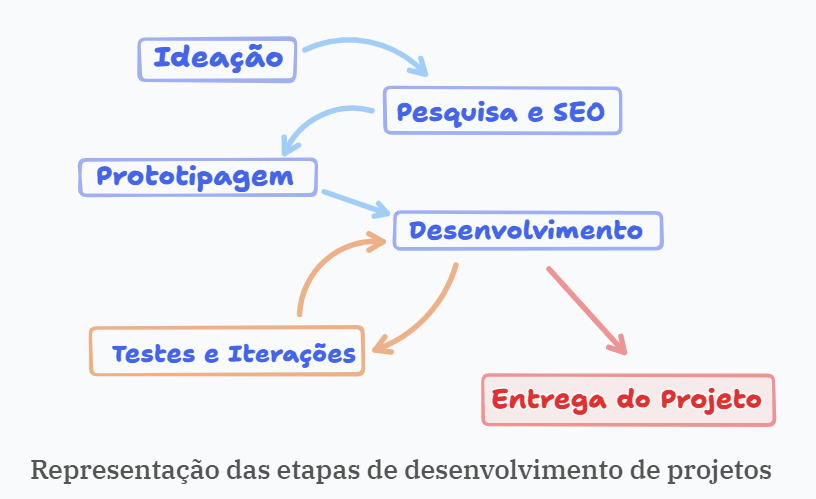
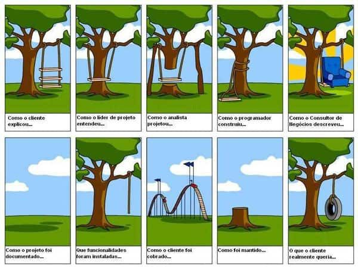

## 📚 Aula 01: UC-04 | Desenvolvimento Web

**✅ Tema:** Revisão e primeiro contato com **desenvolvimento web**.

---

### 🧠 O que vimos hoje?

#### Revisão dos conceitos de _path_ (caminhos) de arquivos e pastas.

- Vimos a importância por saber localizar arquivos a partir do caminho em que este arquivo se encontra.
- Vimos que quando vemos um nome de uma pasta seguida por `/`, significa que "vamos entrar" nesta pasta.
    - `imagens/foto.png` → acessamos a pasta `imagens` e após isto _entramos_ nela (`/`) e acessamos o arquivo `foto.png`.
- Vimos que para _pegar_ um arquivo que esteja uma pasta "acima" de onde nosso arquivo está, isto é, que está em uma pasta anterior ao arquivo em questão: precisamos passar o `../` para dizer ao "computador": _volte um nível_.
- Vimos que tudo que estudamos seguiu corretamente a **documentação oficial** do HTML.[^1]

> Para saber mais sobre `path`, confira o resumo da aula 04 [clicando aqui](../../uc-03-frontend-essencial/aula-04/readme.md) da uc de `front end essencial`.

#### Design Thinking | Etapas do Desenvolvimento de Projetos

  

    
  

   

Para desenvolver um projeto , devemos seguir algumas etapas [^2]. Vimos hoje quais etapas são estas:

1. **Ideação:** diz respeito a etapa inicial. É o momento em que se tem a ideia. É o momento em que é feito o levantamento de requisito junto ao cliente. É o momento de levantar todas as informações necessárias para conseguir **compreender** exatamente como o projeto deve ser. É uma etapa importante.

2. **Pesquisa e SEO**: é nesta etapa em que se faz o levantamento sobre a viabilidade da ideia. É uma etapa precisa sobre o objetivo em que o cliente deseja alcançar.
    - `SEO` (_Search Engine Optimization_) - Otimização para Mecanismos de Busca, é o conjunto de técnicas e estratégias de marketing digital para aumentar a visibilidade e o posicionamento de um site nos resultados orgânicos (gratuitos) de buscadores como Google, Bing e YouTube. 

3. **Prototipagem:** etapa focada na entrega de um modelo baseado nas informações levantadas para gerar um protótipo. _É uma etapa de Desing_. É nesta etapa que é construído o _branding_ (identidade visual) do produto: fontes, cores, logo, imagens, layout da página, etc. Geralmente é gerado um _wireframe_ das telas.
    - Vocês conheceram um pouco com o mestre Azevedo sobre esta etapa. É fundamental para a construção de um produto bem feito.
    - Geralmente é montado um protótipo e enviado ao cliente para aprovação. Pois é mais simples projetar uma tela desenhando do que colocando a mão no código fonte com as tecnologias que estamos aprendendo. 

4. **Desenvolvimento: é aqui onde estamos**. Implementar os protótipos através das diversas tecnologias. O foco aqui é na estrutura do projeto. Criar uma dinâmica em grupo para desenvolver.
    - É aqui que é criado os padrões de projeto que estamos trabalhando: padrões de nomes de pastas, de localização de arquivos, de _stacks_ utilizadas, onde será documentado (_Notion, Miro, Trello_, etc.), versionamento, etc.
    - Existem muitas estratégias para desenvolver projetos, um dos que mais gosto é o **Método Scrum**. <del>Em breve compartilho link do livro</del>
       

5. **Testes e Iterações:** etapa responsável por corrigir bugs (falhas) que acontecem decorrente ao desenvolvimento. Importante para manter sempre atualizado o projeto. Se necessário, retorna à etapa de Desenvolvimento.

6. **Entrega do Produto:** etapa final. É o momento em que colocamos o site no ar. Porém, exige um estudo para que faça direitinho. Chamamos de **deploy**. Exitem algumas etapas como:
    - Registrar nome de domínio (DNS);
    - Hospedagem;
    - Entre outros.

> Na etapa acima, fizemos na uc passada com uma ferramenta que facilitou nosso processo. Serviço como este que gosto muito é a **Vercel** [^3]

🎯 **Leandro** trouxe para nós uma ilustração da importância de entender o que o cliente precisa, sobre a comunicação e sobre a documentação do processo, confira:

  

    
  

   

---

#### O que é Cascading Style Sheets | CSS

CSS (Cascading Style Sheets, ou Folhas de Estilo em Cascata) é uma linguagem de estilo usada para definir a aparência visual de páginas web criadas com HTML. Enquanto o HTML estrutura o conteúdo, o CSS controla o layout, cores, fontes, espaçamentos e responsividade. É fundamental para separar o conteúdo da apresentação, facilitando a manutenção e design de sites. [^4]

- Em resumo serve para mudar a formatação padrão do navegador.

##### CSS Inline

CSS inline é uma técnica de estilização que aplica estilos diretamente na tag de abertura de um elemento HTML usando o atributo style. Ele substitui estilos externos ou internos e é ideal para correções rápidas, testes ou e-mails HTML.
Embora útil, seu uso excessivo não é recomendado, pois polui o código HTML e dificulta a manutenção.
Principais características:

- **Aplicação:** Usado diretamente no elemento:
    - `<h1 style="color: blue;">Texto</h1>`.
- **Prioridade:** Tem prioridade máxima sobre CSS externo ou interno.
- **Uso:** Evitar em grandes projetos para não "poluir" o HTML.Escopo: Aplica-se apenas ao elemento específico onde está definido

---

### 🔗 Links Importantes

[^1]: [Lidando com arquivos](https://developer.mozilla.org/pt-BR/docs/Learn_web_development/Getting_started/Environment_setup/Dealing_with_files)

[^2]: [Etapas da Criação de Um Site | GW2D Desenvolvimento web](https://gw2d.com.br/artigos/7-etapas-da-criacao-de-um-site)

[^3]: [Site da Vercel](https://vercel.com/romisson-oliveiras-projects)

[^4]: [CSS básico](https://developer.mozilla.org/pt-BR/docs/Learn_web_development/Getting_started/Your_first_website/Styling_the_content)
